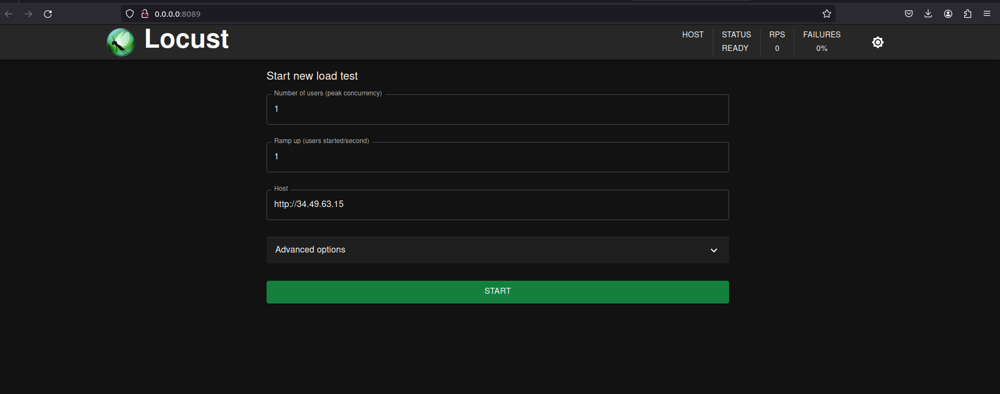

### Sistema Distribuido de Votaciones
#### *SISTEMAS OPERATIVOS 1 SECCIÓN N*

En este proyecto, se tiene como objetivo principal implementar un sistema de votaciones para un
concurso de bandas de música guatemalteca; el propósito de este es enviar tráfico por medio de
archivos con votaciones creadas hacia distintos servicios (grpc y wasm) que van a encolar cada uno
de los datos enviados, así mismo se tendrán ciertos consumidores a la escucha del sistema de colas
para enviar datos a una base de datos en Redis; estos datos se verán en dashboards en tiempo real.
También se tiene una base de datos de Mongodb para guardar los logs, los cuales serán
consultados por medio de una aplicación web

#### Servicios y Stack utilizados

* Google Kubernetes Engine
* Cloud Run
* Go
* Rust
* Python
* Mongo
* Redis
* Kafka
* Grafana
* Locust 

#### Instalacion

##### Locust
para utilizar el generador de tráfico, necesitamos:

1. Crear el entorno virtual (venv):

```bash
python3 -m venv venv
```

2. Activar el entorno virtual:

```bash
source venv/bin/activate
```

3. Instalar las dependencias (requirements.txt)

```bash
pip install -r requirements.txt 
```

4. Compilar y Ejecutar el archivo .py

```bash
locust -f lcst.py
```

##### Estructura de K8S
para poder levantar la estructura debe ser ingresado los .yaml encontrados en la carpeta k8s, se sugiere seguir el siguiente orden:

1. Ingreso de Namespace

```bash
kubectl apply -f namespace.yaml
```

2. levantar Kafka

```bash
kubectl create -f 'https://strimzi.io/install/latest?namespace=so1p2' -n so1p2
```

```bash
kubectl apply -f https://strimzi.io/examples/latest/kafka/kafka-persistent-single.yaml -n so1p2
```

crear el topic

```bash
kubectl apply -f topic.yml
```


3. levantar las bd
carpeta databases como origen

```bash
kubectl apply -f mongo.yaml
```


4. levantar el los proveedores

```bash
kubectl apply -f grpc-depoy.yaml
```

5. levantar el consumer

```bash
kubectl apply -f consumer.yml
```

6. habilitar el hpa al consumer

```bash
kubectl apply -f hpa-consumer.yaml
```

7. levantar ingress

```bash
kubectl apply -f ingress.yaml
```

##### Cloud Run
para levantar nuestra api y cliente en CloudRun debemos dockerizar nuestras
aplicaciones y ademas asegurarnos que docker tenga permiso para manipular
el Artifact Registry


* en caso de no tener ningun artefacto debemos darle autenticacion a gcloud
como en mi caso:

```bash
$ gcloud auth configure-docker us-east1-docker.pkg.dev
```

luego debemos construir las imagenes para linux/arm

api:
```bash
docker buildx build -t us-east1-docker.pkg.dev/sopes2024/mongotools/api --platform linux/amd64 .
```
cliente:
```bash
docker buildx build -t us-east1-docker.pkg.dev/sopes2024/mongotools/web --platform linux/amd64 .
```

y subirlas al Artifact Registry:
```bash
docker push  us-east1-docker.pkg.dev/sopes2024/mongotools/api 
```

```bash
docker push  us-east1-docker.pkg.dev/sopes2024/mongotools/web 
```

configurar manualmente en CloudRun seleccionando servicios por medio
de Artifact Registry y asignarle el respecivo puerto

api: *3000*
web: *80*

#### Modo de Uso
una vez asegudrado la instalacion
procedemos a dirigirnos a Locust
e ingresamos la url al navegador:




dentro del portal de locust ingresamos el host a la cual queremos dirigir el trafico de datos, la url a utilizar se muestra en la imagen anterior


#### Anexos

##### Glosario

*Google Kubernetes Engine:*
es un servicio administrado de Kubernetes ofrecido por Google Cloud Platform. permite aprovechar los beneficios de Kubernetes sin tener que administrar la infraestructura subyacente usted mismo. Google se encarga de la configuración, la gestión y el mantenimiento del clúster de Kubernetes, lo que le libera para centrarse en la creación y la implementación de sus aplicaciones.

*Cloud Run:*
 es una forma sencilla y rentable de ejecutar aplicaciones web y servicios en la nube sin servidor. Es ideal para aplicaciones que necesitan escalar automáticamente y que no requieren un estado continuo.

 *Kafka:* es un sistema de streaming de eventos de código abierto distribuido por Apache Software Foundation.  Funciona como una plataforma centralizada para la ingesta, almacenamiento y procesamiento de flujos de datos en tiempo real.

 *producer:* un productor es una aplicación cliente que publica o envía flujos de datos (mensajes) a un tema específico dentro del cluster de Kafka.  Estos mensajes pueden ser de cualquier tipo de información, como registros del servidor, actualizaciones de stock o datos de sensores, en este caso (datos de votaciones)

*consumer:* un consumidor es una aplicación cliente diseñada para suscribirse a temas específicos y recibir los mensajes que los productores publican en esos temas.

*Grafana:* es una plataforma de código abierto utilizada para la visualización y análisis de datos.  Funciona como un centro de control para que pueda ver sus datos de diversas fuentes en un solo lugar, comprenderlos mejor y tomar decisiones informadas.

*Locust:* es una herramienta de código abierto utilizada para realizar pruebas de carga y rendimiento de aplicaciones web. Se enfoca en simular escenarios de usuarios concurrentes altos, lo que permite identificar cuellos de botella y medir la escalabilidad de una aplicación bajo presión


