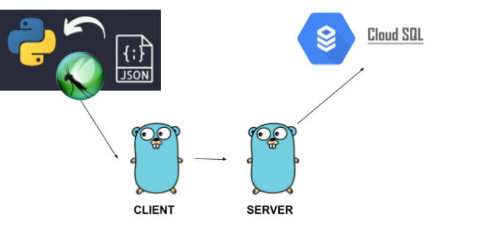

### Locust y gRPC

Realizar un sistema cliente-servidor de tipo gRPC en golang, en el cual se puedan
visualizar datos (del proyecto 2) enviados desde el generador de tráfico locust
construído con python; los datos deben estar en formato JSON. Posteriormente
deben guardarse en una base de datos de Cloud SQL y los datos deben ser
mostrados en un cliente

#### Arquitectura



#### Anexo
video solucion: [Tarea4 Mp4](https://drive.google.com/file/d/1GBUHVUozOlkV816rBtovVzcbcrgwzvD7/view?usp=sharing)


#### EJECUCION

1. Generacion de los Archivos pb y grcp:

   ubicar la carpeta proto dentro de las carpetas client, server respectivamente y ejecutar el comando

   ```bash
       protoc --go_out=. --go-grpc_out=. client.proto
       protoc --go_out=. --go-grpc_out=. server.proto
   ```
2. Verificar las credenciales a la conexion Cloud Sql en el archivo .go

  ```go
    const (
      	DBUser     = "xxx" // root por defecto
      	DBPassword = "" // password de la instancia
      	DBName     = "" // db a la que apuntamos en Cloud SQL
      	DBHost     = ""  // ip de la instancia
      	DBPort     = "" //puerto 3306 por defecto
    )
  ```

3. Ejecutar los archivos cliente.go y server.go

  ```bash
       go run client.go
       go run server.go
  ```

4. levantar el entorno virtual para locust o usar el local

   ```bash
      locust -f lcst.py 
   ```

6. ingresar al navegador y colocar la direccion web

    ```
      0.0.0.0:8089
    ```
   
