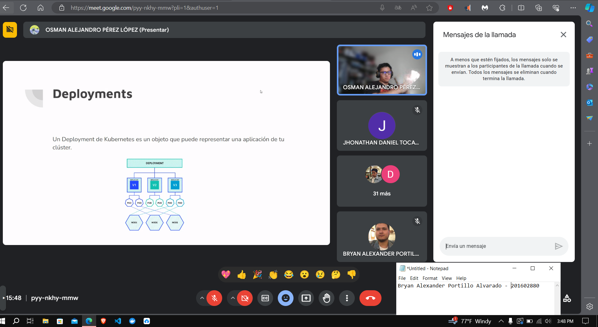

# Ensayo : Tipos de Servicios y la Integración de Kafka con Strimz

Kubernetes ha emergido como una plataforma líder para la orquestación de contenedores, ofreciendo una amplia gama de funcionalidades para desplegar, escalar y gestionar aplicaciones en entornos de nube. En este ensayo se aborda de manera breve los temas concretos en la conferencia impartida por parte del curso de Sistemas Operativos 1, teniendo como centro Kubernetes, los distintos tipos de servicios en Kubernetes ademas de cómo se puede integrar Kafka, un sistema de mensajería distribuida, con Strimzi, una solución diseñada específicamente para Kubernetes.

El conferenciante comenzó su presentación delineando el papel fundamental de Kubernetes en la orquestación de contenedores, subrayando su capacidad para automatizar tareas de despliegue, escalado y gestión en infraestructuras de nube. Se destacaron los diversos tipos de servicios que Kubernetes ofrece para exponer aplicaciones dentro de un clúster, desde el acceso interno con ClusterIP hasta la exposición externa mediante LoadBalancer
de lo que podemos destacar de manera breve que:

ClusterIP: Permite el acceso interno dentro del clúster Kubernetes.
NodePort: Expone el servicio en un puerto estático en cada nodo del clúster.
LoadBalancer: Utiliza un balanceador de carga externo para exponer el servicio a través de una IP externa.

Posteriormente, se adentró en el universo de Kafka, resaltando su importancia como una piedra angular en la arquitectura de datos distribuida. Se discutieron con detalle los conceptos esenciales de Kafka, incluidos los temas, productores/consumidores, ilustrando cómo esta tecnología facilita la transmisión de datos en tiempo real a escala masiva.

Para darle sentido a la teoria el conferencista nos mostró cómo integrar Kafka con Kubernetes a través de Strimzi. Strimzi, es un operador de Kubernetes diseñado específicamente para Kafka, simplifica la implementación y gestión de clústeres Kafka en entornos Kubernetes. Aprendimos cómo Strimzi aprovecha las capacidades nativas de Kubernetes para proporcionar una implementación declarativa y una integración perfecta con el ecosistema Kubernetes.

La conferencia culminó con un análisis de los beneficios que ofrece esta integración,
incluyendo el actual mercado laboral tiene abierta sus puertas a requerimientos de
la implementacion de estas tecnologias ya que Kubernetes y Kafka pueden colaborar de manera sinérgica para construir arquitecturas modernas y escalables.

### Anexos

*Figura 1. Foto Inicio de Conferencia*

*Figura 2. Foto Final de Conferencia*